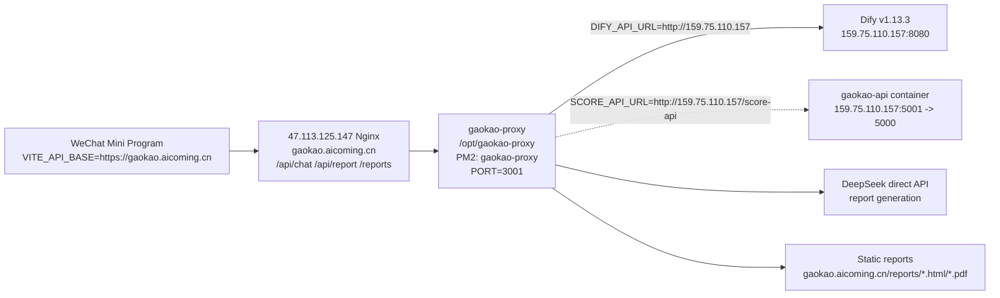

# Current Live Service Chain

> Last verified: 2026-05-28
> Purpose: this is the source of truth for current live routing. Use this before older migration, roadmap, or prompt documents.

## Server Roles

| Host | Current role | Verified evidence |
|---|---|---|
| `159.75.110.157` | Dify v1.13.3, Dify PostgreSQL/Redis/Weaviate stack, `gaokao-api` container | `curl http://159.75.110.157/v1` returns `X-Version: 1.13.3`; SSH `ubuntu@159.75.110.157` shows Dify containers and `gaokao-api` running; from 159 itself `http://127.0.0.1:5001/api/health` returns `{"records":894681,"status":"ok"}`; from 47, `SCORE_API_URL=http://159.75.110.157/score-api` returns healthy score API responses |
| `47.113.125.147` | `gaokao-proxy`, report generation, static report/PDF hosting, exposed as `https://gaokao.aicoming.cn` | `GET https://gaokao.aicoming.cn/api/health` returns `{"status":"ok"}`; static report PDF returns `application/pdf`; authenticated deep-report PDF returns `application/pdf`; PM2 process `gaokao-proxy` runs `/opt/gaokao-proxy` on port `3001`; Nginx routes `/api/chat`, `/api/report`, `/reports` to `127.0.0.1:3001`; HTTP redirects to HTTPS |

## Runtime Chain



## Public Endpoints

### Mini Program API Base

Use:

```bash
VITE_API_BASE=https://gaokao.aicoming.cn
```

Do not use `159.75.110.157` as `VITE_API_BASE`. It is the Dify/application-data host, not the mini-program gateway.

### 47 gaokao-proxy

Verified:

```bash
curl https://gaokao.aicoming.cn/api/health
# {"status":"ok"}
```

Available public routes:

- `GET https://gaokao.aicoming.cn/api/health`
- `POST https://gaokao.aicoming.cn/api/chat`
- `POST https://gaokao.aicoming.cn/api/chat/stream`
- `POST https://gaokao.aicoming.cn/api/report/generate`
- `GET https://gaokao.aicoming.cn/reports/<file>.html`
- `GET https://gaokao.aicoming.cn/reports/<file>.pdf`
- `GET https://gaokao.aicoming.cn/api/reports/health`
- `GET https://gaokao.aicoming.cn/api/reports/major-insights?names=<major1,major2>`
- `POST https://gaokao.aicoming.cn/api/reports/deep/view-token` returns a short-lived online reader URL without requiring membership
- `GET https://gaokao.aicoming.cn/reports/deep/view/<signed-token>` returns the rendered HTML reader while the token is valid
- `GET https://gaokao.aicoming.cn/api/reports/deep/pdf?type=major&id=<code>` with an active member session token

47 server facts verified over SSH:

```bash
ssh -i /Users/MarkHuang/Downloads/mark123-.pem root@47.113.125.147
cd /opt/gaokao-proxy
grep -E '^(DIFY_API_URL|REPORT_BASE_URL|SCORE_API_URL|PORT)=' .env
```

Verified values:

```bash
DIFY_API_URL=http://159.75.110.157
PORT=3001
REPORT_BASE_URL=https://gaokao.aicoming.cn
SCORE_API_URL=http://159.75.110.157/score-api
```

Important score API note: `gaokao-api` is exposed inside 159 as `0.0.0.0:5001->5000`, but 47 should call it through the 159 Nginx route `http://159.75.110.157/score-api`. Direct public checks to `159.75.110.157:5000` and `159.75.110.157:5001` can fail even when `/score-api` is healthy. Verified score routes include `/api/health`, `/api/stats`, `/api/recommend`, `/api/scores/match`, `/api/scores/recommend`, `/api/scores/schools/<name>/provinces/<province>`, and `/api/scores/majors/<keyword>`.

Current membership defaults in code and docs:

```bash
MEMBERSHIP_PRICE_CENTS=1990
MEMBERSHIP_INVITE_REQUIRED=5
MEMBERSHIP_DEEP_REPORT_DOWNLOAD_LIMIT=10
MEMBERSHIP_VIP_CODES=<comma-separated launch/test codes>
DEEPSEEK_MODEL=deepseek-v4-pro
DEEP_REPORT_VIEW_TOKEN_TTL_MS=600000
VITE_PDF_DOWNLOAD_ENABLED=true
```

Payment test note:

- 2026-05-26: 1 yuan WeChat Pay smoke test succeeded on 47 with temporary `MEMBERSHIP_PRICE_CENTS=100`; the paid order became `status=paid` and membership became `source=payment`.
- Before release, restore `MEMBERSHIP_PRICE_CENTS=1990`, set the mini-program price label to `¥19.9`, rebuild/upload the mini program, and re-run one 19.9 yuan payment smoke test.
- 2026-05-28 SSH check: 47 `/opt/gaokao-proxy/.env` still showed `MEMBERSHIP_PRICE_CENTS=100` and `DEEPSEEK_MODEL=deepseek-chat`. Treat this as a release blocker until the server env is updated and PM2 is restarted.

### 159 Dify

Verified:

```bash
curl -I http://159.75.110.157/v1
# X-Version: 1.13.3
# X-Env: PRODUCTION
```

SSH:

```bash
ssh -i /Users/MarkHuang/.ssh/gaokao-new_ed25519 ubuntu@159.75.110.157
```

Verified containers include:

- `docker-nginx-1` exposing `0.0.0.0:8080->80`
- `docker-api-1` healthy
- `docker-worker-1`
- `docker-plugin_daemon-1`
- `docker-pgvector-1`
- `docker-sandbox-1`
- `docker-redis-1`
- `docker-db_postgres-1`
- `gaokao-api` exposing `0.0.0.0:5001->5000`

Verified from 159:

```bash
curl http://127.0.0.1:5001/api/health
# {"records":894681,"status":"ok"}
```

## Request Flow Details

### Chat

1. Mini program calls `https://gaokao.aicoming.cn/api/chat` or `/api/chat/stream`.
2. Nginx on 47 routes request to `127.0.0.1:3001`.
3. `gaokao-proxy/server.js` validates request, applies rate limits, and forwards to `${DIFY_API_URL}/v1/chat-messages`.
4. `DIFY_API_URL` on 47 is `http://159.75.110.157`.
5. Dify on 159 returns blocking JSON or SSE events.
6. `gaokao-proxy` strips `<think>` reasoning blocks and returns cleaned output to the mini program.

### Report Generation

1. Mini program calls `POST https://gaokao.aicoming.cn/api/report/generate`.
2. Nginx on 47 routes to `127.0.0.1:3001`.
3. `gaokao-proxy` validates `userId`, questionnaire completion, MBTI completion, and Holland completion.
4. `gaokao-proxy` builds report context from local report data, optional Dify conversation history, and direct DeepSeek report generation.
5. Generated HTML is saved under the reports directory on 47.
6. Response returns `https://gaokao.aicoming.cn/reports/<file>.html`.

Expected report route shape after the 2026-05-24 domain switch:

```bash
POST https://gaokao.aicoming.cn/api/report/generate
# {"url":"https://gaokao.aicoming.cn/reports/<file>.html"}

GET https://gaokao.aicoming.cn/reports/<file>.html
# 200 text/html

GET https://gaokao.aicoming.cn/reports/<file>.pdf
# 200 application/pdf
```

### PDF Downloads

Verified on 2026-05-25:

```bash
curl -L -s -o /tmp/gaokao-report-domain-test.pdf \
  -w '%{http_code} %{content_type} %{size_download}\n' \
  https://gaokao.aicoming.cn/reports/u_1779266091610_u1ynfoti-1779266155844.pdf
# 200 application/pdf 129882
```

The deep report PDF endpoint is membership protected:

```bash
GET https://gaokao.aicoming.cn/api/reports/deep/pdf?type=major&id=080901
# without Authorization: 401
# with active member Bearer token: 200 application/pdf
```

Online deep report reading is separate from PDF download:

```bash
POST https://gaokao.aicoming.cn/api/reports/deep/view-token
# no membership required: {"url":"https://gaokao.aicoming.cn/reports/deep/view/<signed-token>","expiresIn":600}
```

The reader URL renders a searchable HTML report for free and does not consume `MEMBERSHIP_DEEP_REPORT_DOWNLOAD_LIMIT`. PDF download remains the offline/export action and consumes one quota.

Mini-program builds that should expose PDF download need:

```bash
VITE_PDF_DOWNLOAD_ENABLED=true
```

## Drift Rules

- Treat any document saying mini-program API base should be `159.75.110.157` as stale.
- Before changing report generation, verify 47 first.
- Before changing Dify workflow, knowledge base, plugin, or model config, verify 159 first.
- After any deployment that changes host roles or ports, update this file and `AGENTS.md` in the same change.
