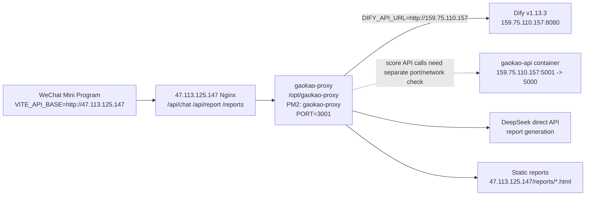

# Current Live Service Chain

> Last verified: 2026-05-14
> Purpose: this is the source of truth for current live routing. Use this before older migration, roadmap, or prompt documents.

## Server Roles

| Host | Current role | Verified evidence |
|---|---|---|
| `159.75.110.157` | Dify v1.13.3, Dify PostgreSQL/Redis/Weaviate stack, `gaokao-api` container | `curl http://159.75.110.157/v1` returns `X-Version: 1.13.3`; SSH `ubuntu@159.75.110.157` shows Dify containers and `gaokao-api` running; from 159 itself `http://127.0.0.1:5001/api/health` returns `{"records":35978,"status":"ok"}` |
| `47.113.125.147` | Public mini-program API base, `gaokao-proxy`, report generation, static report hosting | `GET /api/health` returns `{"status":"ok"}`; PM2 process `gaokao-proxy` runs `/opt/gaokao-proxy` on port `3001`; Nginx routes `/api/chat`, `/api/report`, `/reports` to `127.0.0.1:3001` |
| `8.135.37.159` | Historical old server only | Do not use as current Dify, proxy, report, or mini-program API base |

## Runtime Chain



## Public Endpoints

### Mini Program API Base

Use:

```bash
VITE_API_BASE=http://47.113.125.147
```

Do not use `159.75.110.157` as `VITE_API_BASE`. It is the Dify/application-data host, not the mini-program gateway.

### 47 gaokao-proxy

Verified:

```bash
curl http://47.113.125.147/api/health
# {"status":"ok"}
```

Available public routes:

- `GET http://47.113.125.147/api/health`
- `POST http://47.113.125.147/api/chat`
- `POST http://47.113.125.147/api/chat/stream`
- `POST http://47.113.125.147/api/report/generate`
- `GET http://47.113.125.147/reports/<file>.html`

47 server facts verified over SSH:

```bash
ssh -i /Users/MarkHuang/Downloads/mark123-.pem root@47.113.125.147
cd /opt/gaokao-proxy
grep -E '^(DIFY_API_URL|REPORT_BASE_URL|SCORE_API_URL|PORT)=' .env
```

Verified values:

```bash
DIFY_API_URL=http://159.75.110.157
PORT=3001
REPORT_BASE_URL=http://47.113.125.147
SCORE_API_URL=http://159.75.110.157:5000
```

Important drift note: SSH verification showed `gaokao-api` is exposed on 159 as `0.0.0.0:5001->5000`, and from 159 itself `curl http://127.0.0.1:5001/api/health` returns `{"records":35978,"status":"ok"}`. Public checks to `159.75.110.157:5000` and `159.75.110.157:5001` returned empty/connection-level failures from this environment. If report/data code needs live score API calls from 47, fix `SCORE_API_URL` and the network exposure together; do not assume the current `:5000` value is healthy.

### 159 Dify

Verified:

```bash
curl -I http://159.75.110.157/v1
# X-Version: 1.13.3
# X-Env: PRODUCTION
```

SSH:

```bash
ssh -i /Users/MarkHuang/.ssh/gaokao-new_ed25519 ubuntu@159.75.110.157
```

Verified containers include:

- `docker-nginx-1` exposing `0.0.0.0:8080->80`
- `docker-api-1` healthy
- `docker-worker-1`
- `docker-plugin_daemon-1`
- `docker-pgvector-1`
- `docker-sandbox-1`
- `docker-redis-1`
- `docker-db_postgres-1`
- `gaokao-api` exposing `0.0.0.0:5001->5000`

Verified from 159:

```bash
curl http://127.0.0.1:5001/api/health
# {"records":35978,"status":"ok"}
```

## Request Flow Details

### Chat

1. Mini program calls `http://47.113.125.147/api/chat` or `/api/chat/stream`.
2. Nginx on 47 routes request to `127.0.0.1:3001`.
3. `gaokao-proxy/server.js` validates request, applies rate limits, and forwards to `${DIFY_API_URL}/v1/chat-messages`.
4. `DIFY_API_URL` on 47 is `http://159.75.110.157`.
5. Dify on 159 returns blocking JSON or SSE events.
6. `gaokao-proxy` strips `<think>` reasoning blocks and returns cleaned output to the mini program.

### Report Generation

1. Mini program calls `POST http://47.113.125.147/api/report/generate`.
2. Nginx on 47 routes to `127.0.0.1:3001`.
3. `gaokao-proxy` validates `userId`, questionnaire completion, MBTI completion, and Holland completion.
4. `gaokao-proxy` builds report context from local report data, optional Dify conversation history, and direct DeepSeek report generation.
5. Generated HTML is saved under the reports directory on 47.
6. Response returns `http://47.113.125.147/reports/<file>.html`.

Verified on 2026-05-14:

```bash
POST http://47.113.125.147/api/report/generate
# {"url":"http://47.113.125.147/reports/codex-smoke-20260514-1778737336588.html"}

GET http://47.113.125.147/reports/codex-smoke-20260514-1778737336588.html
# 200 text/html
```

## Drift Rules

- Treat any document saying Dify is currently on `8.135.37.159` as stale.
- Treat any document saying mini-program API base should be `159.75.110.157` as stale.
- Before changing report generation, verify 47 first.
- Before changing Dify workflow, knowledge base, plugin, or model config, verify 159 first.
- After any deployment that changes host roles or ports, update this file and `AGENTS.md` in the same change.
