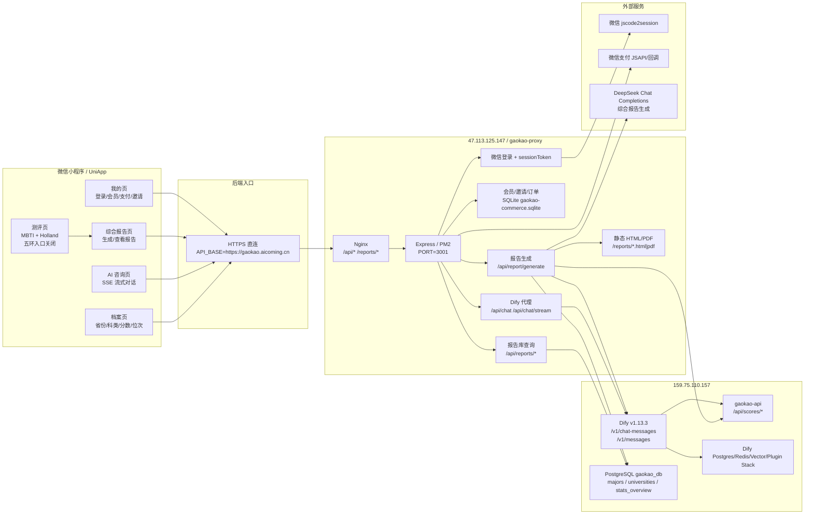
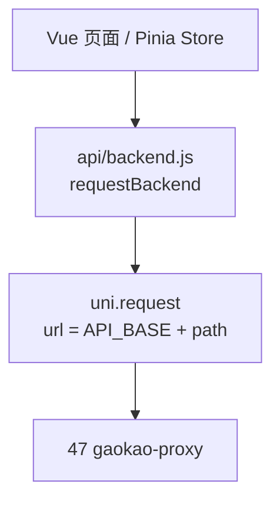
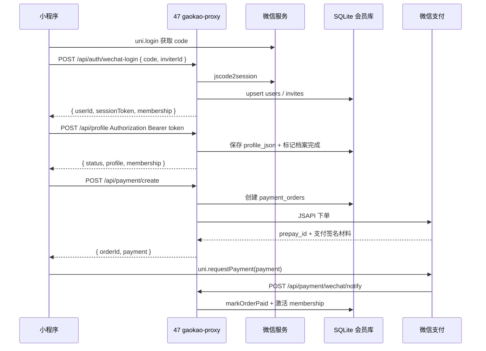
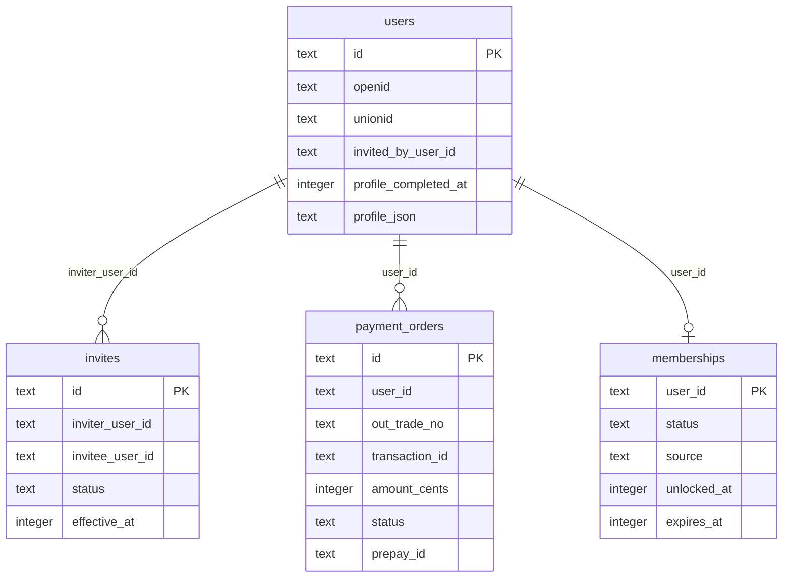
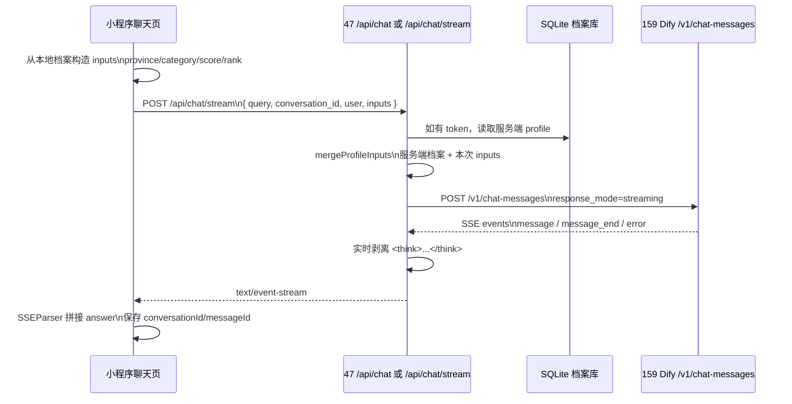
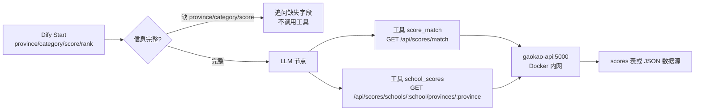
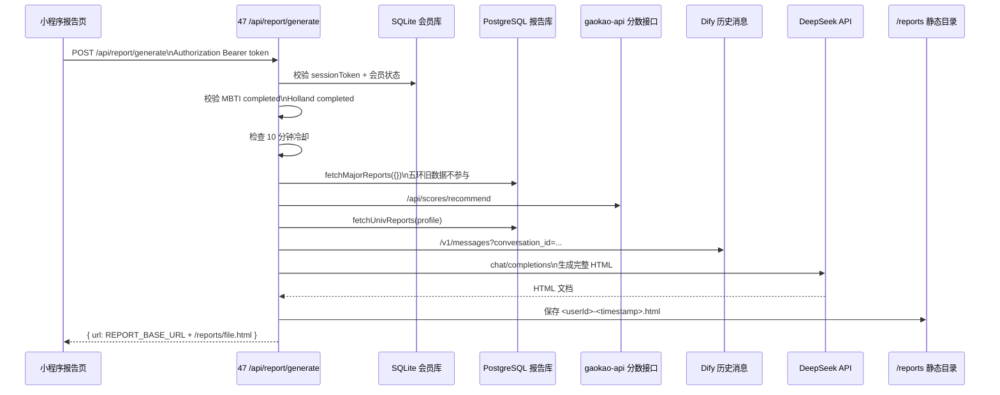
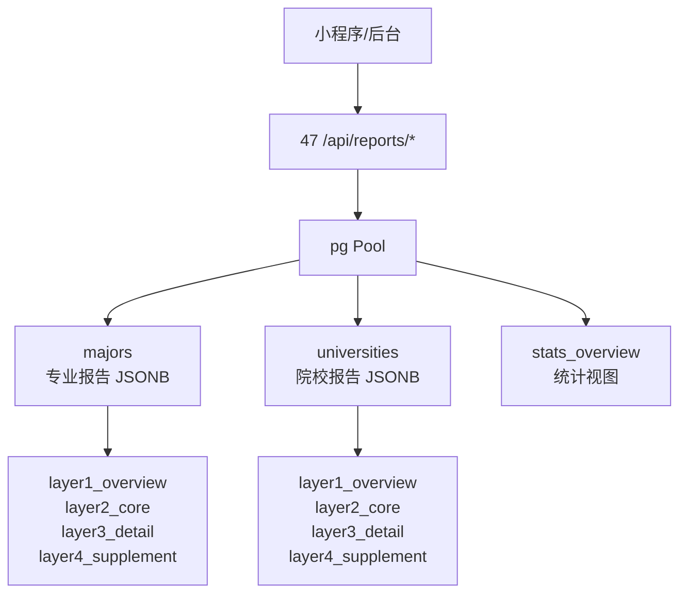
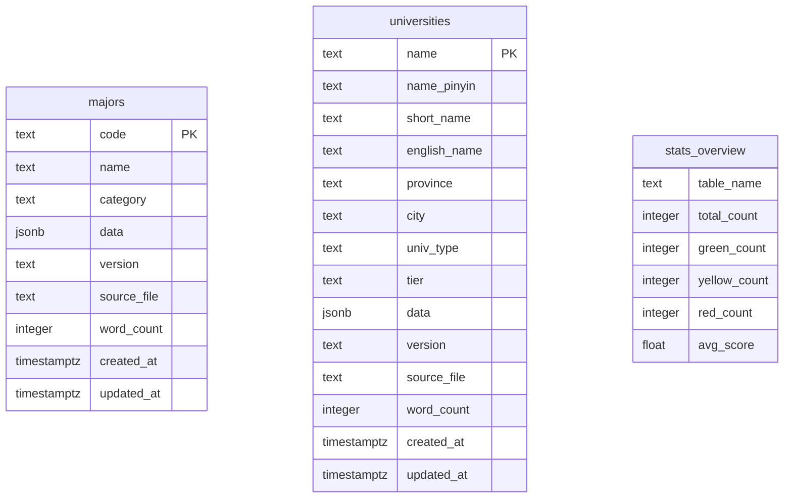
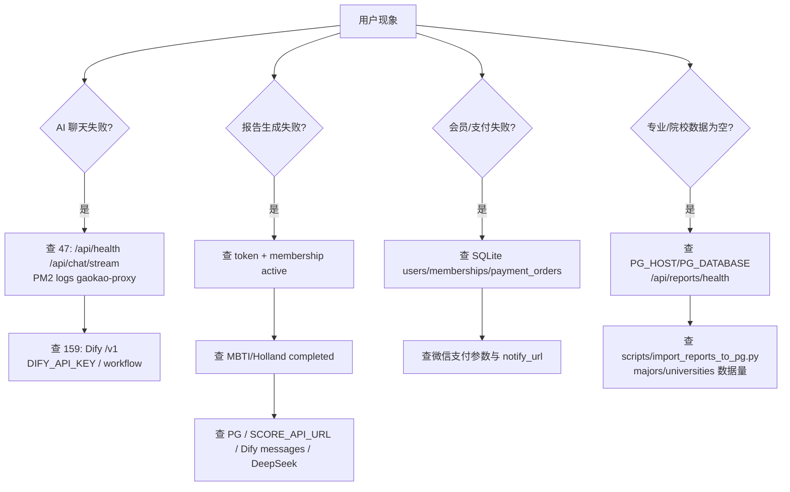

# 小程序前后台调用关系与 Dify/数据 API 可视化梳理

> 适用范围：`gaokao-miniprogram`、`gaokao-proxy`、Dify、分数线 API、报告 PostgreSQL/SQLite 数据。
> 核心结论：小程序不直接访问 Dify 和数据库；所有业务请求先进入后端网关，再由网关决定转发 Dify、查 PostgreSQL/SQLite、调用微信服务、调用 DeepSeek 或读取静态报告。
> 本次公开接口校验：`https://gaokao.aicoming.cn/api/health` 返回 `{"status":"ok"}`；公开综合报告 PDF 返回 `application/pdf`；会员 token 下深度 PDF 返回 `application/pdf`；`http://159.75.110.157/v1` 返回 Dify `X-Version: 1.13.3`、`X-Env: PRODUCTION`。

## 1. 当前线上拓扑



## 2. 前端入口与后端基准地址

| 前端文件 | 作用 | 后端入口 |
|---|---|---|
| `gaokao-miniprogram/src/config.js` | 定义 `API_BASE` 和上线能力开关 | 默认 `https://gaokao.aicoming.cn` |
| `gaokao-miniprogram/src/api/backend.js` | 统一请求封装，所有业务请求走 HTTPS API | `requestBackend()` / `requestBackendData()` |
| `gaokao-miniprogram/src/api/dify.js` | 聊天、SSE、反馈 | `/api/chat/stream`、`/api/chat`、`/api/chat/feedback` |
| `gaokao-miniprogram/src/api/membership.js` | 微信登录、会员、档案、支付 | `/api/auth/wechat-login`、`/api/profile`、`/api/payment/*` |
| `gaokao-miniprogram/src/pages/report/report.vue` | 综合报告生成 | `/api/report/generate` |



## 3. 小程序核心业务链路

### 3.1 用户登录、档案、会员、支付



本链路对应后端数据表：



### 3.2 AI 咨询对话



Dify 请求体由后端最终组装：

```json
{
  "inputs": {
    "province": "广东",
    "category": "物理类",
    "score": "600",
    "rank": "8500"
  },
  "query": "广东 600 分物理类能报什么学校？",
  "response_mode": "streaming",
  "conversation_id": "",
  "user": "u_xxx"
}
```

Dify 返回后，小程序实际消费的 SSE 片段形态：

```text
data: {"event":"message","answer":"可以重点看三类学校...","conversation_id":"...","message_id":"..."}

data: {"event":"message_end","conversation_id":"...","message_id":"..."}
```

后端在 blocking 模式中返回完整 JSON：

```json
{
  "answer": "可以重点看三类学校...",
  "conversation_id": "conv_xxx",
  "message_id": "msg_xxx"
}
```

### 3.3 Dify 内部工具调用与分数 API

Dify Chatflow 的 Start 变量是小程序档案字段，不是用户聊天文本。

| Dify 变量 | 类型 | 来源 | 作用 |
|---|---|---|---|
| `province` | string | 小程序档案 + 后端持久化 profile | 冲稳保、院校分数线查询必需 |
| `category` | string | 小程序档案 + 后端持久化 profile | `物理类` / `历史类`，不得默认 |
| `score` | string | 小程序档案 + 后端持久化 profile | 分数线匹配必需 |
| `rank` | string | 小程序档案 + 后端持久化 profile | 可选，辅助判断 |



gaokao-api 对外暴露的核心接口：

| 接口 | 调用方 | 输入 | 输出 |
|---|---|---|---|
| `GET /api/health` | 运维/健康检查 | 无 | `{ status, records/database }` |
| `GET /api/stats` | 数据检查 | 无 | 总记录数、学校数、年份数、省份数 |
| `GET /api/scores/match` | Dify 工具 `score_match` | `province, score, category, year, limit` | `冲/稳/保` 三档学校 |
| `GET /api/scores/recommend` | 综合报告生成 | `province, score, category, year, limit` | `recommendations[]`，含 `tier` |
| `GET /api/scores/schools/:school/provinces/:province` | Dify 工具 `school_scores` | `school_name, province, year` | 该校在该省专业录取线 |
| `GET /api/scores/majors/:keyword` | 专业分数查询 | `keyword, province?, year?, limit?` | 匹配专业的学校/分数线 |

### 3.4 综合报告生成



报告生成请求体：

```json
{
  "userId": "u_xxx",
  "profile": {
    "province": "广东",
    "category": "物理类",
    "score": 600,
    "rank": 8500
  },
  "assessments": {
    "mbti": {
      "completed": true,
      "type": "INTJ",
      "report": { "name": "建筑师", "tags": ["独立", "战略"] }
    },
    "holland": {
      "completed": true,
      "code": "RIA",
      "scores": { "R": 20, "I": 30, "A": 10, "S": 25, "E": 15, "C": 22 },
      "indicators": [{ "type": "I", "label": "研究型", "score": 30 }]
    }
  },
  "conversationId": "conv_xxx"
}
```

报告生成素材来源：

| 素材 | 代码入口 | 数据来源 | 失败影响 |
|---|---|---|---|
| 专业深度资料 | `fetchMajorReports({})` | PostgreSQL `majors` | 五环旧数据不影响报告；无匹配时专业分析依赖模型与后续深度资料入口 |
| 院校推荐 | `fetchUnivReports(profile)` | gaokao-api `/api/scores/recommend` | 院校推荐为空 |
| 院校深度资料 | `fetchUnivReports(profile)` | PostgreSQL `universities` | 院校深度分析变浅 |
| 历史对话 | `fetchDifyMessages(conversationId)` | Dify `/v1/messages` | 报告少了咨询上下文 |
| 测评结果 | 小程序本地测评 store | MBTI 结果摘要 / Holland code + scores + indicators | MBTI 或 Holland 未完成则直接拒绝生成 |
| 最终 HTML | `generateReport()` | DeepSeek API | 生成失败 |

## 4. 报告库 PostgreSQL API

gaokao-proxy 在 `createReportRoutes(true)` 下挂载报告查询接口，当前代码里是全量访问模式；如果未来要按会员脱敏，需要改这里的 `hasFullAccess` 策略。



| 后端接口 | 查询对象 | 关键参数 | 返回核心字段 |
|---|---|---|---|
| `GET /api/reports/health` | PostgreSQL 连接 | 无 | `{ status, postgres }` |
| `GET /api/reports/stats` | `stats_overview` | 无 | `majors/universities` 总数、绿黄红、平均分 |
| `GET /api/reports/majors` | `majors` | `search, category, level, min_score, page, page_size` | `{ total, page, page_size, data[] }` |
| `GET /api/reports/majors/:code` | `majors` | `code` | 单个专业报告 |
| `GET /api/reports/universities` | `universities` | `search, province, type, level, min_score, page, page_size` | `{ total, page, page_size, data[] }` |
| `GET /api/reports/universities/:name` | `universities` | `name` | 单个院校报告 |

数据库结构：



## 5. 后端接口总览矩阵

| 模块 | 小程序调用 | 47 后端处理 | 下游依赖 | 关键输出 |
|---|---|---|---|---|
| 健康检查 | `GET /api/health` | Express 直接返回 | 无 | `{ status: "ok" }` |
| 登录 | `POST /api/auth/wechat-login` | code 换 openid，签 sessionToken | 微信登录、SQLite | `userId/sessionToken/membership` |
| 档案保存 | `POST /api/profile` | 校验并保存 profile | SQLite | `profile/membership` |
| 会员状态 | `GET /api/membership/status` | token 校验，读会员状态 | SQLite | `status/features/invite` |
| 会员邀请码 | `POST /api/membership/redeem-code` | 优先校验 SQLite `vip_invite_codes`，兼容少量 `MEMBERSHIP_VIP_CODES` 环境变量码，激活会员 | SQLite | `membership` |
| 限时免费 | `POST /api/membership/limited-free-unlock` | 按 `LIMITED_FREE_UNLOCK_ENABLED` 控制一键解锁 | SQLite | `membership` |
| 支付下单 | `POST /api/payment/create` | 创建订单，发起 JSAPI | SQLite、微信支付 | `orderId/payment` |
| 支付回调 | `POST /api/payment/wechat/notify` | 验签/解密/激活会员 | 微信支付、SQLite | `{ code: "SUCCESS" }` |
| AI 阻塞问答 | `POST /api/chat` | 限流、合并档案、转发 Dify、去 `<think>` | Dify | 完整 answer |
| AI 流式问答 | `POST /api/chat/stream` | SSE 转发、流式去 `<think>` | Dify | SSE answer chunks |
| 对话反馈 | `POST /api/chat/feedback` | 写入 JSONL 日志 | 文件系统 | `{ status: "ok" }` |
| 报告生成 | `POST /api/report/generate` | 会员/测评/冷却校验，聚合资料，生成 HTML | SQLite、PostgreSQL、gaokao-api、Dify、DeepSeek | `{ url }` |
| 静态报告 | `GET /reports/:filename` | 返回 HTML；PDF 不存在时懒生成 | 文件系统、PDF 生成器 | HTML/PDF |
| 报告查询 | `GET /api/reports/*` | 查询 majors/universities/stats | PostgreSQL | 报告 JSON |
| 专业组合洞察 | `GET /api/reports/major-insights` | 按专业名称聚合结构化信息 | PostgreSQL | `data[]` |
| 深度在线阅读 | `POST /api/reports/deep/view-token` -> `GET /reports/deep/view/:token` | 免费生成短期签名链接并渲染 HTML 阅读器 | PostgreSQL、HTML 渲染器 | 可搜索 HTML |
| 深度 PDF | `GET /api/reports/deep/pdf` | 会员/额度校验，生成学校或专业 PDF | SQLite、PostgreSQL、PDF 生成器 | `application/pdf` |

## 6. 关键运行时事实与注意点

1. 当前小程序公网 API 基准地址应是 `https://gaokao.aicoming.cn`，不是 `159.75.110.157`，也不是旧的 `http://47.113.125.147`。
2. `159.75.110.157` 是 Dify、Dify 依赖栈、`gaokao-api` 与报告 PostgreSQL 数据的核心服务器。
3. 47 的 `gaokao-proxy` 会把 `/api/chat` 和 `/api/chat/stream` 转发到 `${DIFY_API_URL}/v1/chat-messages`；因此 `DIFY_API_URL` 不应重复带 `/v1`。
4. 报告生成依赖多段链路：会员状态、测评完整性、PostgreSQL、分数 API、Dify 历史消息、DeepSeek。排障时应先判断失败发生在哪一段。
5. 深度报告在线阅读用短期签名链接，不消耗 PDF 下载额度；PDF 下载仍消耗 `MEMBERSHIP_DEEP_REPORT_DOWNLOAD_LIMIT`。
6. 分数 API 的 live 入口是 159 Nginx 反代 `http://159.75.110.157/score-api`；直接公开访问 `:5000` 或 `:5001` 失败时，不等于 47 到分数 API 链路失败。

## 7. 排障入口图


